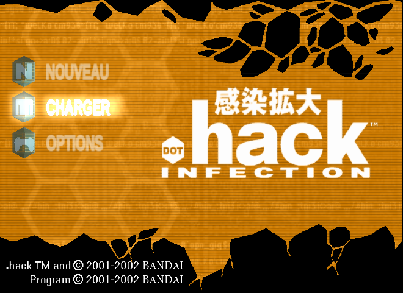

# .hack//Infection — Traduction française (PS2)

Patch de traduction française non officielle de **.hack//Infection** (PlayStation 2, version USA).

---

## ⚠️ Avertissement

- Ce dépôt ne contient **aucun fichier du jeu** ni aucune ISO. Il distribue uniquement un patch (les différences) et les outils qui ont servi à le fabriquer.
- Vous devez posséder le jeu et utiliser **votre propre copie** (dump de votre disque).
- Le partage d'ISO est interdit dans le cadre de ce projet. Ne demandez pas de lien.
- Patch fourni tel quel, sans garantie. Gardez une copie de votre ISO d'origine et de vos sauvegardes.
- Testé sur **PCSX2** (PC). Non testé sur une vraie PS2 (OPL, etc.) : à vos risques, retours bienvenus.

## 📋 Jeu requis

| | |
|---|---|
| Jeu | .hack//Infection (Part 1) |
| Version | **USA** — SLUS-202.67 |
| Format | ISO |
| MD5 de l'ISO d'origine | `eca5b2c41b7833ee38d489002c7aabc4` |

Si votre ISO a une autre empreinte MD5, le patch ne s'appliquera pas (autre version ou dump différent).

## 📥 Installation

1. Téléchargez le dernier patch `dothack-infection-fr.xdelta` dans les [Releases](../../releases).
2. Appliquez-le sur votre ISO USA avec l'une de ces méthodes :

   **Méthode 1 — Delta Patcher (Windows, Linux, macOS)**
   - Téléchargez [Delta Patcher](https://github.com/marco-calautti/DeltaPatcher/releases).
   - *Original file* : votre ISO USA. *XDelta patch* : `dothack-infection-fr.xdelta`.
   - Cliquez sur *Apply patch*.
   - ⚠️ Delta Patcher modifie le fichier d'origine : travaillez sur une **copie** de votre ISO.

   **Méthode 2 — en ligne, sans rien installer**
   - Ouvrez [Rom Patcher JS](https://www.marcrobledo.com/RomPatcher.js/).
   - *ROM file* : votre ISO USA. *Patch file* : `dothack-infection-fr.xdelta`.
   - Cliquez sur *Apply patch* et enregistrez la nouvelle ISO.
   - L'ISO fait 2,5 Go : selon le navigateur et la RAM, ça peut échouer. Dans ce cas, utilisez la méthode 1.

   **Méthode 3 — script Windows fourni**
   - Voir le dossier [`patcher/`](patcher/) : glissez votre ISO sur `appliquer_patch.bat`.

3. Lancez l'ISO patchée dans PCSX2.

## ✅ Ce qui est traduit

| Contenu | État |
|---|---|
| Dialogues de l'histoire et cinématiques | ✅ |
| Mails (326) et réponses de Kite (294) | ✅ |
| Forum (messages et titres des fils) | ✅ |
| Bureau, menus, options, écran d'inscription | ✅ |
| PNJ des villes, bulles de groupe, combats, tutoriels | ✅ |
| Objets, armes, armures, monstres, boutiques, compétences | ✅ |
| Livres Ryu, liste des Grunty | ✅ |
| Textures : écran titre, Épitaphe du Crépuscule, articles de news, accueil du bureau | ✅ |
| Accents français dans la police du jeu | ✅ |

### Choix de traduction

- Les termes propres à « The World » restent en anglais, comme dans l'anime : *Chaos Gate*, *Gate Out*, *Data Drain*, *Virus Core*, *Root Town*, *Recorder*, *Elf's Haven*.
- Les noms propres, les mots inventés des sorts (*Repth*, *Vak Kruz*…) et les noms japonais d'armes sont conservés.
- Les mots-clés des zones (ex. *Bursting Passed Over Aqua Field*) restent en anglais : le jeu assemble les noms de zone mot par mot.
- Tutoiement entre joueurs ; vouvoiement pour CC Corp, les messages système, les vendeurs et certains personnages (Piros, Ryoko Terajima).

Le lexique complet est dans [GLOSSAIRE.md](GLOSSAIRE.md).

### Limites connues

- Les mentions de copyright de l'écran titre et le générique de fin restent en anglais.
- 52 images d'articles de news sont des restes japonais des volumes suivants, jamais affichées dans ce volume : non traitées.

## 🐞 Signaler un problème

Ouvrez une [Issue](../../issues) avec :
- une capture d'écran,
- l'endroit du jeu (zone, ville, menu),
- le texte fautif (coupé, débordant, resté en anglais, faute…).

## 🛠️ Pour les curieux et les développeurs

Les outils de romhacking (Python) sont dans [`romhack/`](romhack/). Le fonctionnement, la reconstruction du patch depuis votre ISO et l'organisation des fichiers de traduction sont décrits dans [DEVELOPPEMENT.md](DEVELOPPEMENT.md).

## 👥 Crédits

Voir [CREDITS.md](CREDITS.md).

## 📜 Licence

Patch, traductions et outils sous licence **[CC BY-NC-SA 4.0](LICENSE.md)** : partage et modification autorisés avec crédit, pas d'usage commercial, même licence pour les dérivés.

*.hack//Infection* © 2001-2002 BANDAI / CyberConnect2. Projet de fans sans lien avec les ayants droit.
